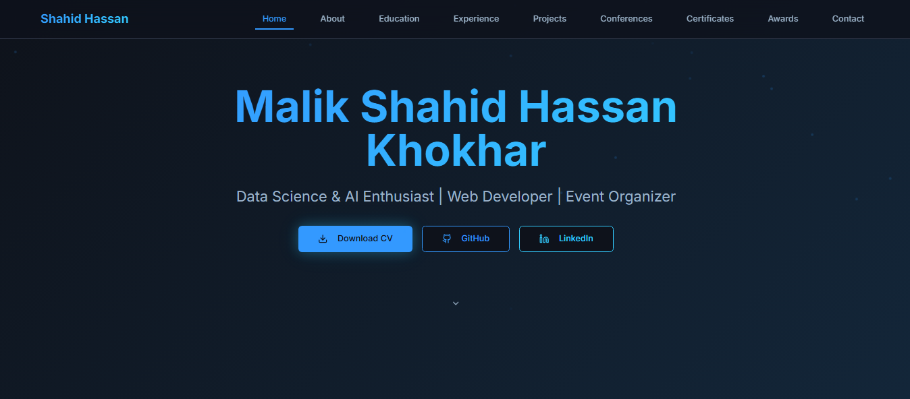

# 🌐 Shahid Hassan - Personal Portfolio Website

A modern, high-performance portfolio website built with **React**, **TypeScript**, and **Tailwind CSS**, powered by **Supabase** as a backend CMS. This site dynamically showcases my projects, experience, education, and skills.


 
*<!-- Replace the above placeholder with an actual screenshot of your site -->*

## 🚀 Live Demo

🔗 **[Visit My Portfolio](https://shahidhassan.vercel.app/)**

## ✨ Features

- **⚡ Blazing Fast**: Built with Vite for optimal performance and development experience.
- **📱 Fully Responsive**: Looks great on desktop, tablet, and mobile devices.
- **🎨 Modern UI**: Clean and professional design using Tailwind CSS.
- **🔧 Dynamic Content**: All content (Projects, Experience, etc.) is managed through a Supabase database, making updates easy without code changes.
- **🌙 Dark Mode**: Includes a sleek dark mode for better user experience.
- **📬 Functional Contact Form**: A working form that sends messages directly to my inbox.

## 🛠️ Tech Stack

- **Frontend Framework**: [React](https://reactjs.org/) + [TypeScript](https://www.typescriptlang.org/)
- **Build Tool**: [Vite](https://vitejs.dev/)
- **Styling**: [Tailwind CSS](https://tailwindcss.com/)
- **Backend & Database**: [Supabase](https://supabase.com/) (PostgreSQL)
- **Deployment**: [Vercel](https://vercel.com/)
- **Icons**: [React Icons](https://react-icons.github.io/react-icons/)

## 📦 Installation & Local Setup

Want to run this portfolio locally or use it as a template? Follow these steps:

1.  **Clone the repository**
    ```bash
    git clone https://github.com/Markhor072/shahid-portfolio.git
    cd shahid-portfolio
    ```

2.  **Install dependencies**
    ```bash
    npm install
    ```

3.  **Set up environment variables**
    - Duplicate the `.env.example` file and rename it to `.env`.
    - Get your Supabase URL and anonymous public key from your Supabase project settings (`Settings` > `API`).
    - Fill in the values in the `.env` file:
    ```env
    VITE_SUPABASE_URL=your_supabase_project_url
    VITE_SUPABASE_ANON_KEY=your_supabase_anon_key
    ```

4.  **Run the development server**
    ```bash
    npm run dev
    ```
    Open [http://localhost:5173](http://localhost:5173) to view it in the browser.

## 🗄️ Supabase Setup (Content Management)

This portfolio uses Supabase tables to store dynamic content. To set up your own, create the following tables in your Supabase project:

1.  **`profiles`**: For your personal/bio information.
2.  **`education`**: For your academic history.
3.  **`experiences`**: For your work experience.
4.  **`projects`**: To showcase your projects.
5.  **`skills`**: To list your technical skills.

The React hooks (`src/hooks/useSupabase.ts`) will fetch data from these tables. Ensure your Supabase project policies allow for public read access (select) on these tables if you want the content to be publicly visible.

## 📁 Project Structure
src/

├── components/ # Reusable React components

├── hooks/ # Custom React hooks (e.g., useSupabase for data fetching)

├── lib/ # Utility libraries (e.g., supabaseClient configuration)

├── App.tsx # Main application component

└── main.tsx # Application entry point

## 🚀 Deployment

The site is configured for easy deployment on **Vercel**:

1.  Push your code to a GitHub repository.
2.  Connect your repository to [Vercel](https://vercel.com/).
3.  Add your environment variables (`VITE_SUPABASE_URL`, `VITE_SUPABASE_ANON_KEY`) in the Vercel dashboard.
4.  Deploy! Vercel will automatically deploy your site on every push to the `main` branch.

## 🤝 Contributing

Contributions, issues, and feature requests are welcome! Feel free to check the [issues page](https://github.com/Markhor072/shahid-portfolio/issues).

If you want to use this as a template for your own portfolio, please give credit by linking back to this repository. ❤️

## 📄 License

This project is open source and available under the [MIT License](LICENSE).

## 📬 Contact & Connect
I'm always open to discussing new projects, creative ideas, or opportunities to be part of your vision.

🌐 Portfolio: https://shahidhassan.vercel.app

💼 LinkedIn: Connect with me

🐙 GitHub: @Markhor072

📧 Email: <shahidhassankhokhar@gmail.com>

⭐ **If you like this project, don't forget to give it a star on GitHub!**
